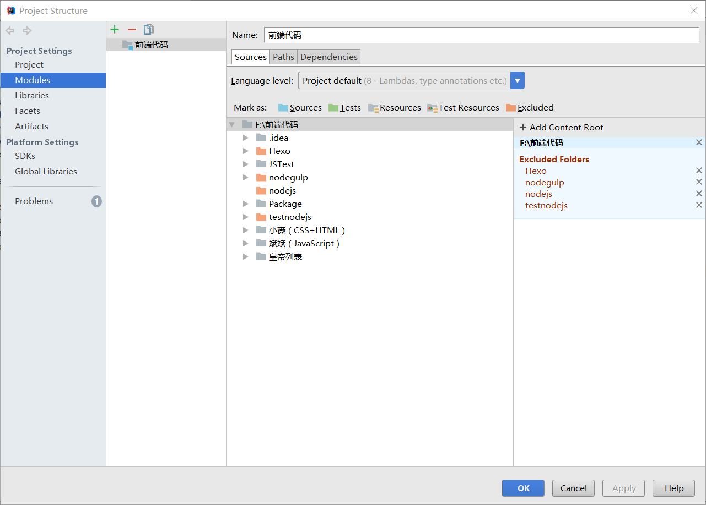
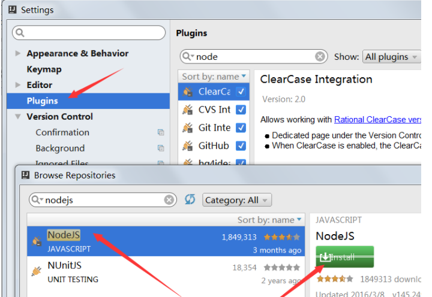

#### 1.解决intellij中不提示js的办法
- 使用了其他环境后，代码提示不再提示Js了
- 可以在File-Project Structure-Modules中 Excluded对你造成影响的代码的文件夹

<!--more-->

#### 2. 
可以通过ctrl+shift+m移动到括号外面

#### 3. 在intellij中安装node模块
打开“文件”菜单，选择“设置”，选择"Plugins",输入"nodeJS",再点击安装即可。

